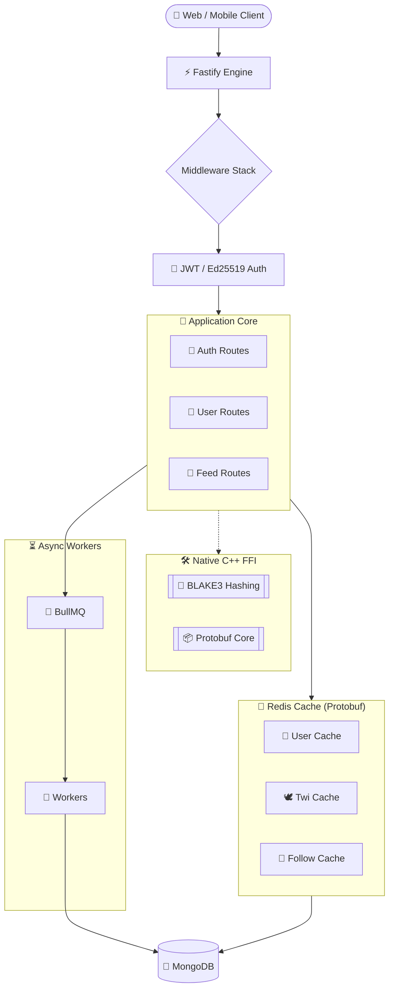

# Twivo – High-Performance Social Backend API

Twivo is a performance-focused backend API for a modern social media platform inspired by Twitter/X. Built with **Bun**, **Fastify**, and **Native C++**, it is designed for high-concurrency environments with a cache-first read strategy and SIMD-accelerated data processing.

[](https://bun.sh)
[](https://www.fastify.io/)
[](https://redis.io/)
[](https://www.mongodb.com/)
[](https://isocpp.org/)

---

## 🚀 Key Features

- **⚡ High-Performance Runtime:** Powered by [Bun](https://bun.sh) for ultra-fast execution and zero-copy FFI.
- **🛡️ Stateless Authentication:** Passwordless magic-link authentication with JWT rotation and Ed25519 signed tokens.
- **🧠 Cache-First Architecture:** Redis-backed read layer with Protobuf serialization for minimal latency.
- **🛠️ Native C++ Core:** SIMD-accelerated BLAKE3 hashing and Protobuf C++ core integrated via Bun FFI.
- **⏳ Async Processing:** Robust background job processing using BullMQ and Redis Streams.
- **📦 Protobuf Serialization:** Binary data format for internal communication and caching to reduce memory footprint.

---

## 🏗️ Architecture Overview

Twivo follows a modular, service-oriented architecture designed for scalability.



---

## 🛠️ Tech Stack

### Backend
- **Runtime:** Bun
- **Framework:** Fastify
- **Database:** MongoDB (Mongoose)
- **Cache:** Redis (ioredis)
- **Serialization:** Protocol Buffers (protobufjs & C++ Core)

### Security & Native
- **Hashing:** BLAKE3 (Native C++)
- **Signatures:** Ed25519 (Token Maker)
- **Auth:** Stateless JWT + Refresh Token Rotation
- **Security:** Helmet, CORS, Rate Limiting

### Infrastructure
- **Orchestration:** Docker Compose
- **Native Build:** CMake + vcpkg
- **Queuing:** BullMQ + Redis Streams

---

## 🔐 Authentication Model (Passwordless)

Twivo uses a fully passwordless model. No passwords are ever stored.

1. **Sign/Login:** User requests a magic link via `/api/auth/sign`.
2. **Verification:** Server sends a time-limited token. Verification happens via `/api/auth/login`.
3. **Session:** Server issues a 10m Access Token and a 7d Refresh Token (rotated on use).
4. **Security:** Refresh tokens are hashed using BLAKE3 before storage.

---

## 🛠️ Installation & Setup

### Prerequisites
- [Docker](https://www.docker.com/) & [Docker Compose](https://docs.docker.com/compose/)
- [Bun](https://bun.sh) (Optional, for local development)

### Quick Start with Docker
The easiest way to get Twivo running is using Docker Compose:

```bash
# Clone the repository
git clone https://github.com/husseinayyed/twivo-backend.git
cd twivo-backend

# Setup environment variables
cp .env.example .env

# Build and start the services
docker compose up --build
```

### Local Native Build
To build the C++ native modules locally:

```bash
cd native
mkdir build && cd build
cmake .. -DCMAKE_BUILD_TYPE=Release
make -j$(nproc)
```

---

## 📂 Project Structure

```text
twivo-backend/
├── native/             # 🛠️ C++ Native Modules (BLAKE3, Protobuf)
├── protobuf/           # 📦 .proto definitions and JS setup
├── Redis/              # 🧠 Cache-first logic for Users, Twis, and Likes
├── queue/              # 🚀 BullMQ queue definitions
├── worker/             # 👷 Background job processors
├── consumer/           # 📥 Redis Stream consumers
├── routes/             # 🛣️ API Endpoints (Auth, User, Feed)
├── models/             # 💾 MongoDB (Mongoose) schemas
├── middleware/         # 🛡️ JWT and Security middleware
├── utils/              # 🛠️ Utility functions (DB, Cache, Ed25519)
└── server.js           # ⚡ Fastify Entry Point
```

---

## 🧪 Testing

Twivo uses Bun's built-in test runner for high-speed integration testing.

```bash
# Run integration tests
npm run test-i
```

---

## 🗺️ Roadmap

- [x] Fastify Migration
- [x] Redis Cache-First Strategy
- [x] Native C++ BLAKE3 Integration
- [ ] WebSocket Real-Time Updates
- [ ] Distributed Media Processing
- [ ] Notification Microservice

---

## 📜 License

This project is licensed under the [GNU Affero General Public License v3.0](LICENSE).

---

## 👤 Author

**Hussein Ayyed**
- GitHub: [@husseinayyed](https://github.com/husseinayyed)
